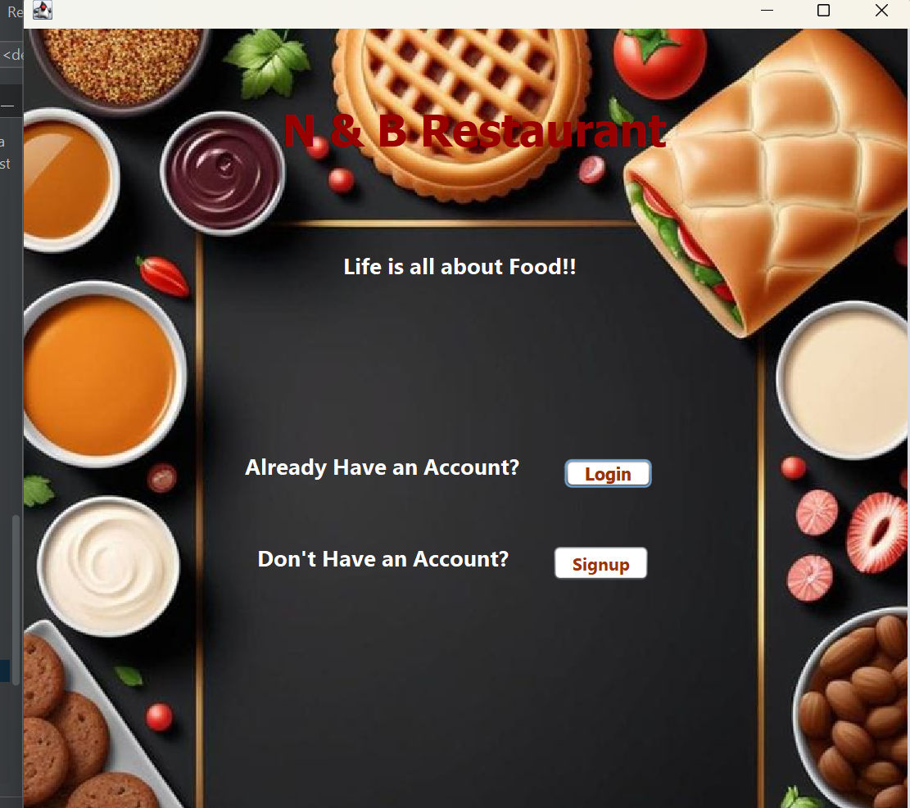
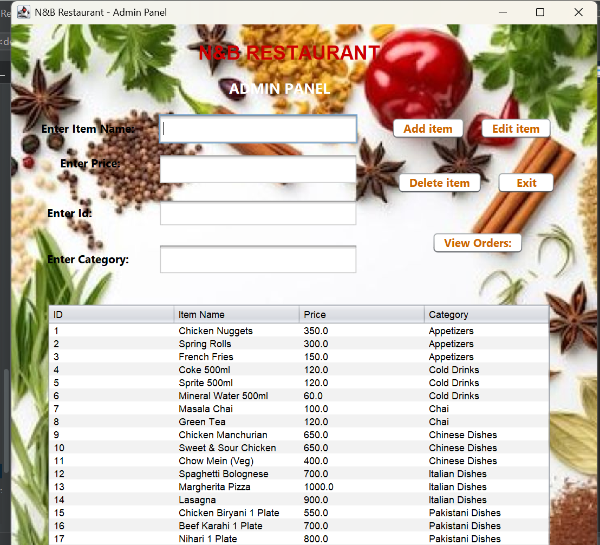
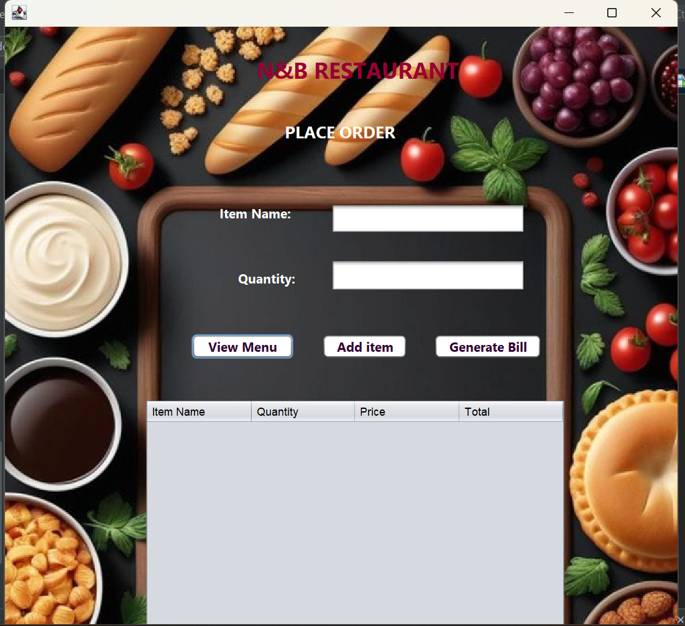
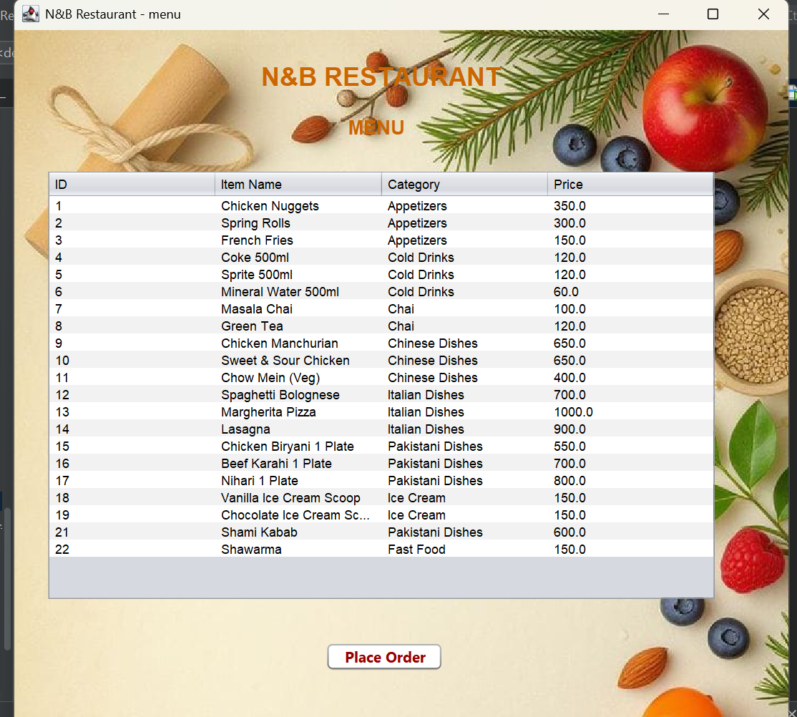
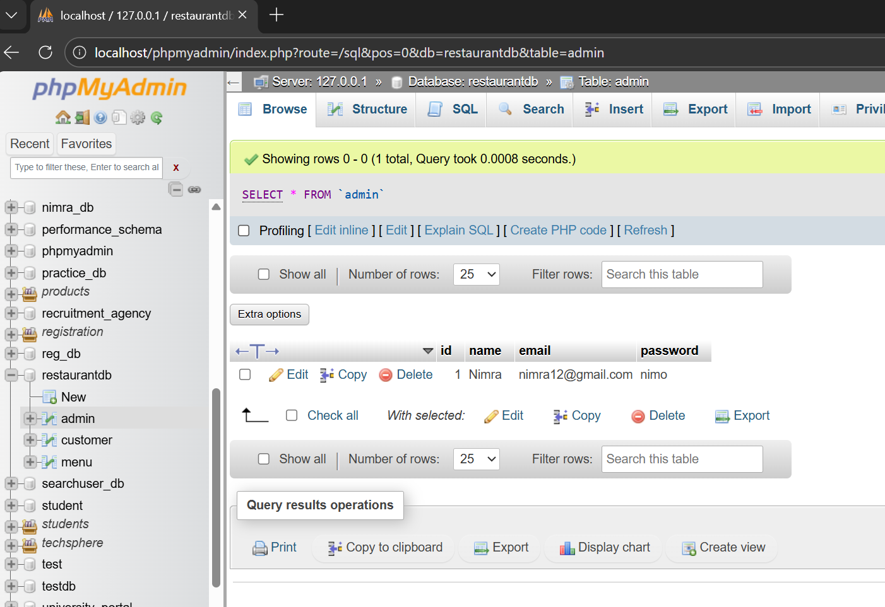
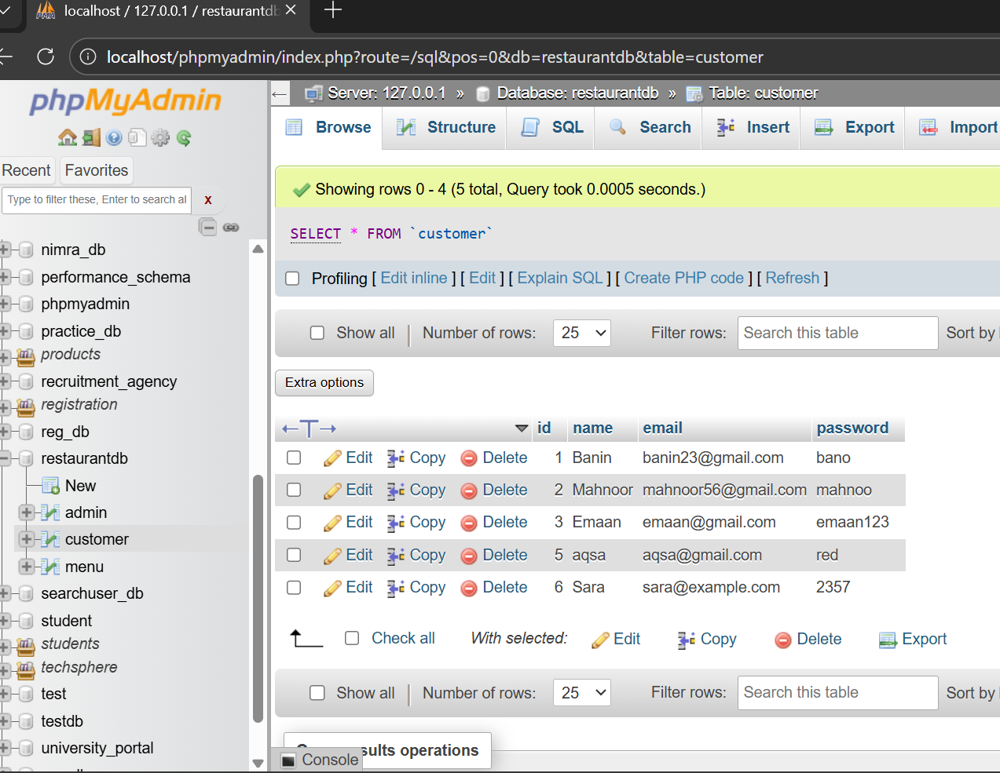
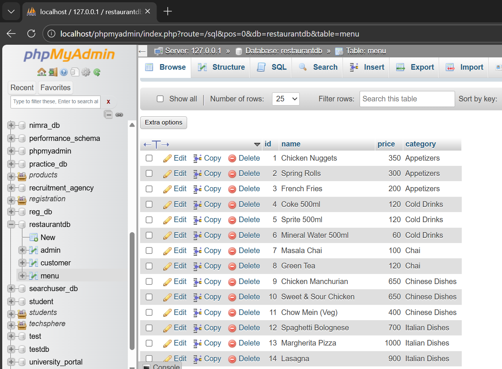

# Restaurant Order Simulation System

##  Project Overview

The Restaurant Order Simulation System is a Java-based desktop application developed for the Object-Oriented Programming (CS283) course at Shifa Tameer-e-Millat University.

The system simulates real-world restaurant operations including:

* Admin login and management
* Customer signup and login
* Menu management
* Order placement
* Database integration using JDBC
* GUI built using Java Swing

---

##  Project Architecture

The system follows a layered architecture:

### 1️⃣ Frontend Package (GUI)

* MainFrame.java
* Login.java
* SignUp.java
* AdminPanel.java
* MenuForm.java
* OrderForm.java

### 2️⃣ Backend Package (Logic)

* UserManager
* MenuManager
* OrderManager
* User
* Admin
* Customer
* MenuItem
* Order

### 3️⃣ Connection Package

* DBConnection.java (JDBC connectivity)

---

## 🔄 System Flow

1. User opens MainFrame.
2. User selects Login or Signup.
3. Login verified through UserManager using database.
4. Admin → Redirected to AdminPanel.
5. Customer → Redirected to MenuForm.
6. Orders processed via OrderManager.
7. Menu and User data stored in MySQL database.
8. Used file handling on bill generation and view order.

---

##  Technologies Used

* Java (JDK)
* Java Swing (GUI)
* MySQL
* JDBC
* NetBeans IDE

---

##  OOP Concepts Implemented

* Encapsulation
* Inheritance
* Polymorphism
* Abstraction
* Separation of Frontend & Backend
* Database Connectivity (JDBC)

---

## 🗄 Database Design

Tables used:

* Admin
* Customer
* Menu
---

##  Screenshots

### 🔹 MainFrame

### 🔹 Admin Panel

### 🔹 Customer Order

### 🔹 Menu

### 🔹 Database Tables

---

## Testing

Test cases were implemented for:

* Valid login
* Invalid login
* Signup functionality
* Add/Edit/Delete menu item
* Order placement

---

##  Future Improvements

* Online payment gateway
* Web-based version
* Mobile compatibility
* Real-time order tracking
* Orders will be stored in  database.

---

## Developed By

Nimra Tariq
BSCS – 2nd Semester
Shifa Tameer-e-Millat University, Islamabad

